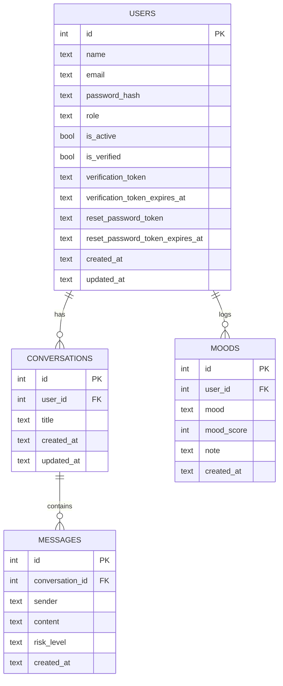
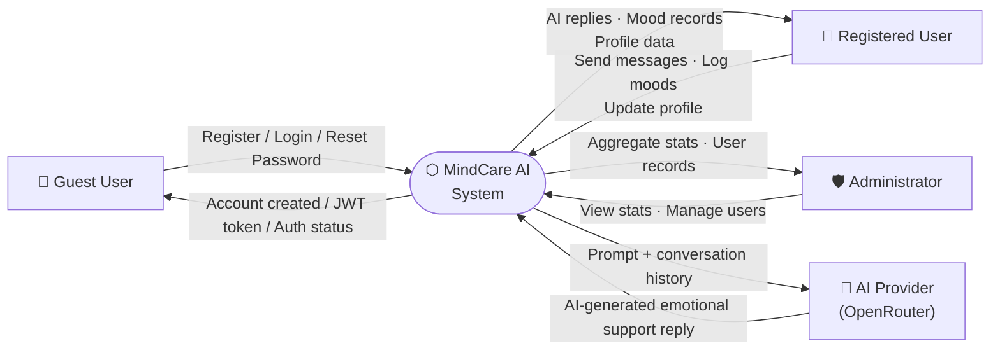
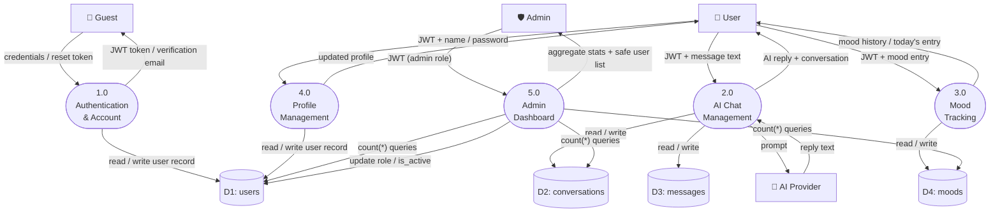

# MindCare AI — Database Design & System Diagrams

> **Application:** AI Emotional Support Platform  
> **Database:** SQLite (via Drizzle ORM) · **Backend:** Fastify (Node.js) · **Frontend:** React SPA

---

## 1. Database Design

### 1.1 Entity-Relationship Diagram

### 1.2 Table Specifications

#### `users`
| Column | Type | Constraint | Default | Notes |
|--------|------|-----------|---------|-------|
| `id` | INTEGER | PK, Auto-increment | — | |
| `name` | TEXT | NOT NULL | — | |
| `email` | TEXT | NOT NULL, UNIQUE | — | Normalized lowercase |
| `password_hash` | TEXT | NOT NULL | — | scrypt (`salt:hash`) |
| `role` | TEXT | NOT NULL, ENUM | `'user'` | `'user'` or `'admin'` |
| `is_active` | INTEGER (bool) | NOT NULL | `1` | `0` = deactivated |
| `is_verified` | INTEGER (bool) | NOT NULL | `0` | Must verify email to login |
| `verification_token` | TEXT | NULL | — | 32-byte hex, 24 h expiry |
| `verification_token_expires_at` | TEXT | NULL | — | ISO 8601 |
| `reset_password_token` | TEXT | NULL | — | 32-byte hex, 1 h expiry |
| `reset_password_token_expires_at` | TEXT | NULL | — | ISO 8601 |
| `created_at` | TEXT | NOT NULL | `datetime('now')` | |
| `updated_at` | TEXT | NOT NULL | `datetime('now')` | |

#### `conversations`
| Column | Type | Constraint | Default |
|--------|------|-----------|---------|
| `id` | INTEGER | PK, Auto-increment | — |
| `user_id` | INTEGER | NOT NULL, FK → `users.id` ON DELETE CASCADE | — |
| `title` | TEXT | NOT NULL | — |
| `created_at` | TEXT | NOT NULL | `datetime('now')` |
| `updated_at` | TEXT | NOT NULL | `datetime('now')` |

#### `messages`
| Column | Type | Constraint | Default |
|--------|------|-----------|---------|
| `id` | INTEGER | PK, Auto-increment | — |
| `conversation_id` | INTEGER | NOT NULL, FK → `conversations.id` ON DELETE CASCADE | — |
| `sender` | TEXT | NOT NULL, ENUM `'user'` \| `'assistant'` | — |
| `content` | TEXT | NOT NULL | — |
| `risk_level` | TEXT | NOT NULL, ENUM `'low'` \| `'moderate'` \| `'high'` | `'low'` |
| `created_at` | TEXT | NOT NULL | `datetime('now')` |

#### `moods`
| Column | Type | Constraint | Default | Notes |
|--------|------|-----------|---------|-------|
| `id` | INTEGER | PK, Auto-increment | — | |
| `user_id` | INTEGER | NOT NULL, FK → `users.id` ON DELETE CASCADE | — | |
| `mood` | TEXT | NOT NULL, ENUM | `'okay'` | `great/good/okay/bad/terrible` |
| `mood_score` | INTEGER | NOT NULL | `3` | Scale 1 (worst) – 5 (best) |
| `note` | TEXT | NULL | — | Private; never exposed to admin |
| `created_at` | TEXT | NOT NULL | `datetime('now')` | |

### 1.3 Cascade Delete Rules

| When this row is deleted | These rows are also deleted |
|--------------------------|-----------------------------|
| A `users` row | All of that user's `conversations` and `moods` |
| A `conversations` row | All of that conversation's `messages` |

---

## 2. Use Case Diagram

```mermaid
graph TB
    subgraph Actors
        GU["👤 Guest User"]
        RU["🔐 Registered User"]
        AD["🛡️ Administrator"]
        AI["🤖 AI System\n(OpenRouter)"]
    end

    subgraph Authentication
        UC1["Register Account"]
        UC2["Verify Email"]
        UC3["Login"]
        UC4["Forgot Password"]
        UC5["Reset Password"]
        UC6["Logout"]
    end

    subgraph User Features
        UC7["Start AI Conversation"]
        UC8["Send Message / Receive AI Reply"]
        UC9["View Conversation History"]
        UC10["Log Daily Mood Check-in"]
        UC11["View Mood History"]
        UC12["View Wellbeing Resources"]
        UC13["Update Profile Name"]
        UC14["Change Password"]
    end

    subgraph Admin Features
        UC15["View App Statistics"]
        UC16["Search & List Users"]
        UC17["Change User Role"]
        UC18["Activate / Deactivate Account"]
    end

    GU --> UC1
    GU --> UC2
    GU --> UC3
    GU --> UC4
    GU --> UC5

    RU --> UC3
    RU --> UC6
    RU --> UC7
    RU --> UC8
    RU --> UC9
    RU --> UC10
    RU --> UC11
    RU --> UC12
    RU --> UC13
    RU --> UC14

    UC8 -. "requests AI reply" .-> AI

    AD --> UC3
    AD --> UC15
    AD --> UC16
    AD --> UC17
    AD --> UC18
```

---

## 3. DFD Level 0 — Context Diagram

---

## 4. DFD Level 1 — Major Processes

> **Privacy note on Process 5.0:** The Admin Dashboard process only issues `COUNT(*)` aggregate queries against `D2: conversations` and `D4: moods`. It **never reads** `messages.content` or `moods.note` columns.

---

## 5. Enum Reference

| Table | Column | Allowed Values |
|-------|--------|----------------|
| `users` | `role` | `user` · `admin` |
| `messages` | `sender` | `user` · `assistant` |
| `messages` | `risk_level` | `low` · `moderate` · `high` |
| `moods` | `mood` | `great` · `good` · `okay` · `bad` · `terrible` |
| `moods` | `mood_score` | `1` (terrible) → `5` (great) |
